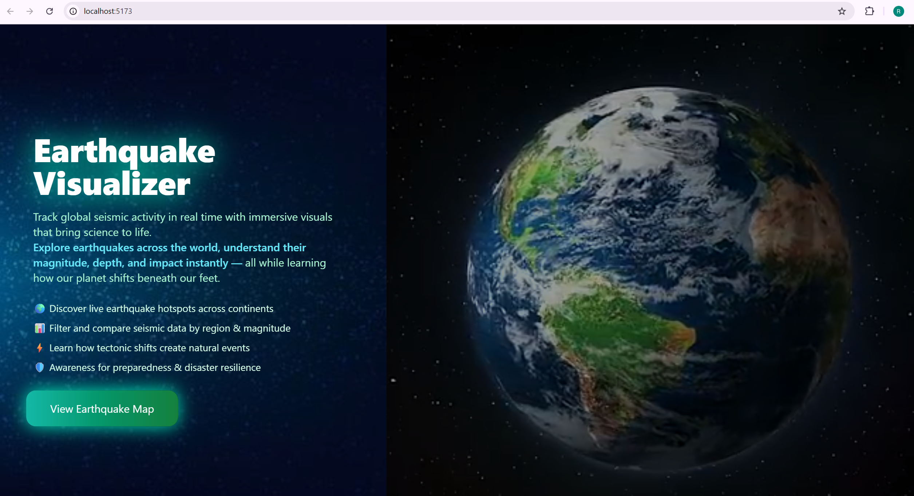
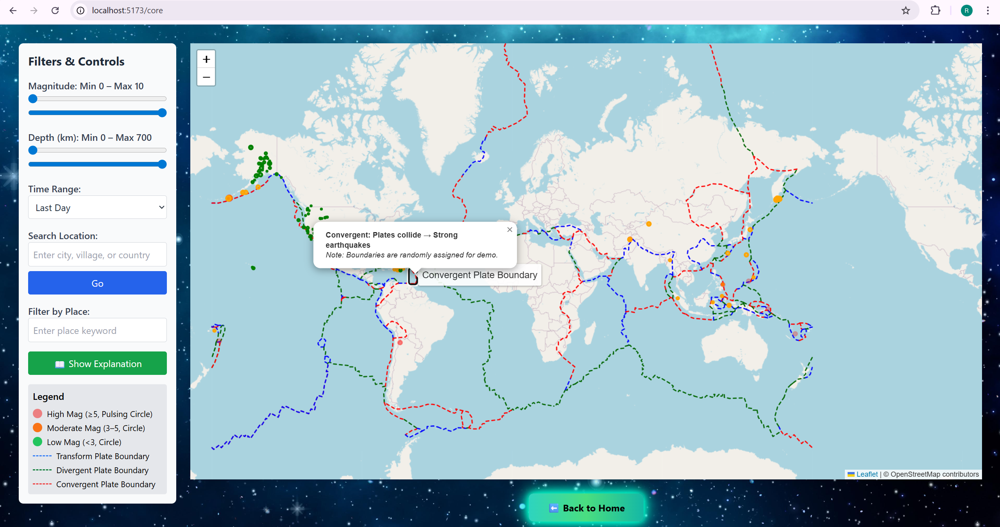
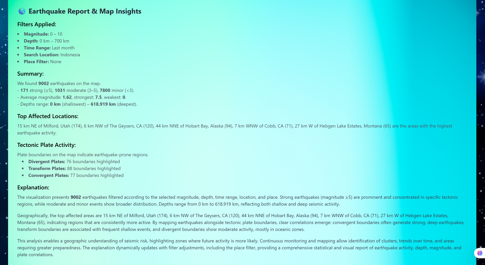

```markdown
# 🌍 Earthquake Visualizer  

> An interactive web-based platform to **analyze and visualize global earthquakes in real time**, empowering researchers, students, and the general public to explore seismic activity with ease.  

📂 **GitHub Repo:** [https://github.com/ramya02-26/earthquake-visualizer](https://github.com/ramya02-26/earthquake-visualizer)  

---

## 🎯 Motivation  

Earthquakes are among the most unpredictable natural disasters. While raw data is available through APIs like USGS, it’s often difficult for non-experts to **interpret and visualize seismic activity**.  

This project bridges that gap by transforming raw earthquake datasets into **intuitive, interactive visualizations**.  

- 📊 Helps **researchers** quickly identify seismic patterns  
- 🧑‍🎓 Provides **students** with an educational tool for geoscience learning  
- 🌍 Allows **anyone** to visually explore earthquake hotspots across the globe  

---

## ✨ Features  

- 🗺️ **Interactive World Map** – Powered by **Leaflet.js & React-Leaflet**  
- 🌋 **Tectonic Plate Boundaries** overlay (GeoJSON integration)  
- 🔴 **Dynamic Epicenter Circles** – Pulsating, color-coded by magnitude  
- 🕒 **Timeline Play/Pause Animation** for earthquake sequences  
- ℹ️ **Detailed Popups & Tooltips** – Magnitude, depth, location, time  
- 📱 **Fully Responsive UI** – Optimized for mobile & desktop  
- ⚡ **Fast & Lightweight** – Built with **Vite + React**  

---

## 🛠️ Tech Stack  

| Layer              | Tools & Libraries                                  |
|--------------------|----------------------------------------------------|
| **Frontend**       | React.js (Vite), React-Leaflet, Leaflet.js, GeoJSON |
| **Styling**        | TailwindCSS / CSS Modules, Custom Animations        |
| **Data Sources**   | USGS Earthquake API / GeoJSON datasets              |
| **Deployment**     | StackBlitz, CodeSandbox, (Vercel/Netlify optional) |
| **Version Control**| Git & GitHub                                        |

---


```
## 📂 Project Structure  

```text
earthquake-visualizer/
├── assets/          # Project images, GIFs, and icons
├── public/          # Public static files (backgrounds, media)
├── src/             # Source code
│   ├── pages/       # Page-level components
│   ├── App.jsx      # Root component
│   ├── index.css    # Global styles
│   └── main.jsx     # Entry point
├── index.html       # Main HTML template
├── package.json     # Dependencies & scripts
└── vite.config.js   # Vite build configuration


````

---

## ⚡ Quick Start  

1️⃣ Clone the repo  
```bash
git clone https://github.com/ramya02-26/earthquake-visualizer.git
cd earthquake-visualizer
````

2️⃣ Install dependencies

```bash
npm install
```

3️⃣ Run locally

```bash
npm run dev
```

4️⃣ Open in browser → `http://localhost:5173/`

---

## 🌐 Deployment

* **StackBlitz Demo:** https://stackblitz.com/~/github.com/ramya02-26/earthquake-visualizer

## 📸 Screenshots & Preview

## 🎥 Demo (Quick Preview)

<p align="center">
   
</p>

## 📸 Screenshots

<p align="center">
    
  <br/>
  <em>🏠 Homepage</em>
</p>

### 🌍 World Earthquake Map and 🔴 Epicenter Visualization

<p align="center">
    
  <br/>
  <em>🗺️ Earthquake Map</em>
</p>


### Explnation panel

<p align="center">
    
  <br/>
  <em>📊 Explanation Dashboard</em>
</p>
---
## Demo Video 🎥
[Click here to watch the demo](https://drive.google.com/file/d/1cOW0zQ1_jpgDtTF4w8NHdprXQc2tiJ1J/view?usp=drive_link)


## 🔮 Future Roadmap

* ⏳ Historical earthquake playback (multi-year datasets)
* 📊 Seismic analytics dashboard (graphs, charts, heatmaps)
* 🌐 Satellite basemap layers (Mapbox, OpenStreetMap)
* ⚠️ Early warning system integration (real-time alerts)
* 📱 PWA mobile app version

---

## 📖 Engineering & Learning Notes

While building this project, I explored:

* 🔗 Integrating **geospatial APIs** with React apps
* 🗺️ Handling **GeoJSON overlays** in Leaflet
* 🎨 Designing **pulsating circle animations** for epicenters
* 🕹️ Creating **timeline-based earthquake playback controls**
* ⚡ Optimizing builds with **Vite**
* 🌐 Deploying professional React apps on cloud-based platforms

These challenges strengthened my expertise in **frontend engineering, geospatial data visualization, and UI/UX design for data-heavy applications**.

---

## 👩‍💻 About the Author

**Ramya Chandrasekher**

* 🎓 B.Tech CSE @ VMTW (2022–2026) | CGPA: 8.5
* 💡 Skilled in React, Python, Java, Flask, SQL, and Machine Learning, Frontend UI/UX


## ⭐ Contribute

Contributions, issues, and feature requests are welcome!
If you found this project helpful, don’t forget to give it a **star ⭐** on GitHub.

